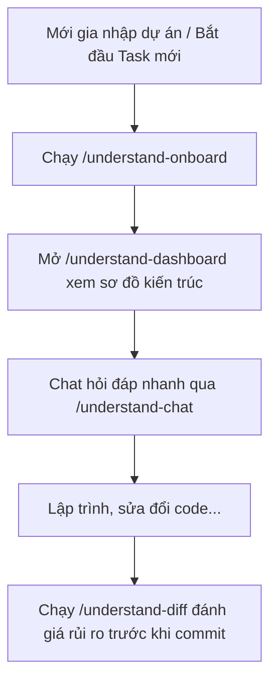

# Hướng dẫn nhanh sử dụng "Understand Anything"

**Understand Anything** là bộ công cụ kết hợp Trí tuệ nhân tạo (LLM) và Phân tích tĩnh (Static Analysis) để chuyển đổi toàn bộ codebase phức tạp thành một **Bản đồ tri thức tương tác (Interactive Knowledge Graph)** và Dashboard trực quan.

---

## 1. Cách cài đặt & Kích hoạt
Bạn có thể dễ dàng nạp bộ kỹ năng này vào AI Agent (như *Antigravity, Claude Code, Cursor, Cline, Copilot*,...) bằng lệnh:
```bash
npx skills add lum1104/understand-anything
```

---

## 2. Bảng tra cứu nhanh 8 lệnh (Skills)

| Lệnh | Chức năng chi tiết | Tác dụng | Khi nào nên dùng? |
| :--- | :--- | :--- | :--- |
| **`/understand`** | Quét toàn bộ mã nguồn, xây dựng cơ sở dữ liệu quan hệ (file, class, function). | Tạo nền tảng dữ liệu tri thức của dự án. | • Khi mới tiếp cận một codebase lạ.<br>• Khi dự án có những thay đổi lớn về mặt cấu trúc. |
| **`/understand-dashboard`** | Khởi chạy một Web Dashboard tương tác (React Flow) hiển thị sơ đồ 2D. | Xem trực quan hóa mối quan hệ phụ thuộc giữa các file/module. | • Khi cần thảo luận về kiến trúc hệ thống.<br>• Muốn tìm nhanh tệp tin mà không cần lục lọi cấu trúc thư mục. |
| **`/understand-onboard`** | Sinh hướng dẫn onboard chi tiết, tự động phân tích các vùng mã phức tạp. | Rút ngắn thời gian đọc tài liệu và làm quen dự án. | • Khi lập trình viên mới gia nhập đội ngũ.<br>• Khi cần bàn giao dự án cho người khác. |
| **`/understand-explain`** | Giải thích logic nghiệp vụ, thuật toán phức tạp hoặc kiến trúc tổng thể. | Chuyển đổi mã nguồn khó hiểu thành ngôn ngữ tự nhiên rõ ràng. | • Khi gặp một đoạn code di sản (legacy code) viết rối rắm.<br>• Khi cần viết tài liệu giải trình kỹ thuật. |
| **`/understand-chat`** | Kích hoạt chatbot hỏi đáp tương tác chuyên biệt về cấu trúc codebase. | Trả lời nhanh các câu hỏi tra cứu vị trí logic của dự án. | • Khi muốn tìm nhanh luồng nghiệp vụ (Ví dụ: *"Nơi xử lý API thanh toán ở đâu?"*). |
| **`/understand-diff`** | Đọc git diff và phân tích tác động (Impact Analysis) của sự thay đổi. | Cảnh báo trước các rủi ro, lỗi tiềm ẩn khi sửa đổi code. | • Trước khi gửi Pull Request (PR) để review.<br>• Khi muốn biết sửa hàm A ở file này có làm lỗi hàm B ở file kia không. |
| **`/understand-domain`** | Trích xuất và hệ thống hóa thuật ngữ nghiệp vụ đặc thù (Domain Knowledge). | Giúp AI Agent hiểu đúng ngữ cảnh và văn hóa đặt tên của dự án. | • Khi dự án có nhiều từ viết tắt, quy ước nội bộ khó hiểu. |
| **`/understand-knowledge`** | Quản lý và kết hợp tài liệu API, đặc tả yêu cầu (specs) sẵn có với code thực tế. | Đảm bảo câu trả lời của AI đồng bộ giữa tài liệu thiết kế và code thực tế. | • Khi cần đối chiếu xem code đã viết đúng chuẩn so với thiết kế PRD ban đầu chưa. |

---

## 3. Kịch bản sử dụng thực tế (Workflow mẫu)



1. **Bước 1: Khởi động & Làm quen**
   * Chạy `/understand` để quét dự án. Lệnh này sẽ tự động mở `/understand-dashboard` cho bạn xem sơ đồ trực quan.
2. **Bước 2: Tìm hiểu nghiệp vụ**
   * Sử dụng `/understand-onboard` để xem báo cáo phân tích độ phức tạp của codebase.
3. **Bước 3: Lập trình & Refactor an toàn**
   * Trước khi push code, chạy `/understand-diff` để kiểm tra tác động và đảm bảo không phá vỡ cấu trúc cũ.
